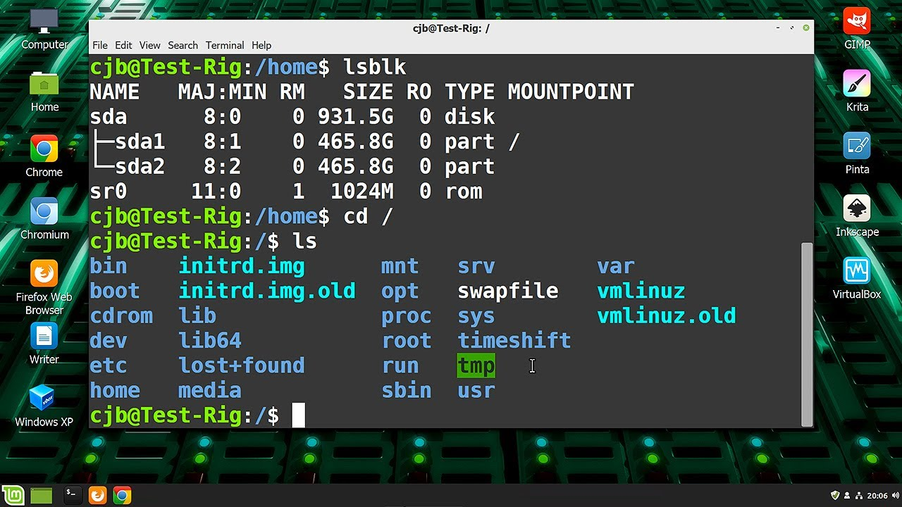
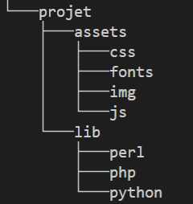

###### Intro à la programmation 
# Préparation

## Avant-propos

Bienvenue dans cette introduction à la programmation. 
Pour vos débuts, vous aller apprendre les bases du développement en PHP55.

Si ce n'est pas encore fait, nous vous encourageons vivement à installer les extensions suivantes de VSCode :

- **Markdown Preview Enhanced** : il vous permettra de visualiser les fichiers ".md" (comme celui-ci) de façon plus propre, dans une fenêtre dédiée (icone en haut à droite de cette fenêteou raccourci Ctrl+k v)
- **PHP Intelephense** : C'est une aide précieuse pour la programmation en PHP. Il améliorer la saisie semi-automatique.

### Terminal : notions de base

Vous voici sur le seuil du monde merveilleux des geeks à grosses lunettes, cheveux gras et tee-shirt Iron Maiden. Et comme tout geek, vous allez travailler principalement dans le terminal. Le terminal c'est quoi ? C'est ce truc merveilleux :



**Sexy !**

Pour info, il est possible de totalement contrôler tous les aspects d'une machine via le terminal. C'est exactement ce que font les vilains pirates.

Pour ouvrir le terminal sous VSCode, si ce n'est déjà fait, depuis le menu général faites __*"Terminal > Nouveau terminal"*__.

Dans le terminal, on se promène à l'intérieur des dossiers de l'ordinateur, et on peut passer de dossiers en dossiers pour lancer des __*"commandes"*__, c'est à dire des instructions que l'ordinateur va devoir éxécuter.

Voici quelques commandes de base du terminal que vous allez devoir apprendre à maîtriser rapidement :

- `ls` : fournit la liste des fichiers et dossiers du dossier actuel (si sur votre système `ls` n'est pas assez verbeux, essayez `ls -l`)
- `cd` : permet de se déplacer à l'intérieur des dossiers comme suit :
    - `cd nomDossier` : permet de rentrer dans le dossier **"nomDossier"** si il existe.
    - `cd nomDossier1/NomDossier1/NomDossier3` : permet de se rendre directement dans le sous-dossier **"NomDossier3"**
    - `cd .. :` permet de revenir en arrière d'un dossier
    - `cd ../.. :` permet de revenir en arrière de deux dossiers.On peut bien sûr répéter ainsi autant de `..` que nécessaire
- `mkdir nomDossier` : Crée le dossier **"nomDossier"** dans le dossier actuel
- `rmdir nomDossier` : Détruit le dossier **"nomDossier"** (si il existe), et tout ce qu'il contient. Et, dans le terminal, pas de corbeille alors *ATTENTION !*)
- `clear` : efface le contenu du terminal. Très utile quand on a déjà lancé pleins de commandes et que notre terminal est pollué de messages.
- `history` : historique des commandes effectuées précédemment. Très utile si vous voulez retrouver une ancienne commande. A noter que vous pouvez rappeler ces anciennes commandes grâce aux flèches de votre clavier (ça évite d'avoir à les retaper à chaque fois).
- `tree` : affiche l'arborescence du dossier actuel.

### Entrainez-vous !

Là, tout de suite, maintenant, créez l'arborescence suivante dans votre dossier actuel en utilisant uniquement le terminal :



Vérifiez votre travail en revenant dans votre dossier principal et en lançant la commande `tree`.

Une fois terminé, vous pouvez supprimer tous vos dossiers et sous-dossiers.

### Premier fichier PHP

Maintenant que vous êtes un pro du terminal, vous allez pouvoir créer votre premier fichier PHP et le tester.

Créez un fichier *'00-test-php.php'* et ouvrez le dans vscode.

**Tapez le code suivant :**

```PHP
<?php
echo 'Hello World !';
```

N'oubliez pas de sauvegarder.

> Note : Si vous ne voulez pas vous embêter avec la sauvegarde à chaque fois, dans vscode cliquez sur __*'fichier->autosave'*__.

Maintenant, dans le terminal, tapez `php 00-test-php.php` et faites `entrée`.


### Test de question à l'utilisateur

L'une des commandes de base que vous allez devoir tout de suite maîtriser pour écrire du PHP en ligne de commande, c'est à dire un programme qui s'éxécute uniquement dans le terminal, est la commande qui permet de demander quelque chose à l'utilisateur.

En PHP, c'est extrêmement simple.

Créez un nouveau fichier `php 00-test-question.php`.

**Tapez le code suivant :**

```PHP
<?php
    $nom = readline ('Comment vous appelez-vous ? ');
    echo 'Bonjour ' . $nom;
```

Esxécuter votre code en tapant la commande `php 00-test-question.php` dans le terminal.

**Résultat attendu :**

```
Comment vous appelez-vous ? J.-S.
Bonjour J.-S.
```

Très bien, vous êtes prêts à attaquer votre apprentissage de la programmation PHP.

