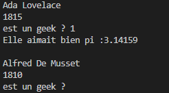

###### Intro à la programmation

# Les variables

## Avant-propos

### Les point-virgules

Dans les exemples ci-après, vous verrez que toutes les lignes de code se terminent par un `;` (point-virgule).

C'est une règle dans un grand nombre de langages de programmation que de finir les instructions de code par des point-virgules. 

En PHP, l'usage d'un  `;` est obligatoire pour indiquer la fin d'une instruction (sauf quelques exceptions). C'est très souvent la cause première de bugs chez des développeurs débutants, alors prenez tout de suite l'habitude de mettre des `;`, cela vous évitera bien des problèmes.

### Les commentaires

Vous verrez aussi, dans des exemples de code des doubles slash `//` ou des slashs `/` suivis ou précédés d'astérisques `*`.

**Exemple :**

```PHP
// Ce commentaire est sur une seule ligne
// je dois remettre des // à  chaque nouvelle ligne

/*
    Ou alors j'écris mon commentaire comme ceci
    C'est beaucoup plus pratique pour faire 
    des commentaires de plusieurs lignes.
*/

/************************************************
 * Gros bloc
 * 
 * Et alors, là, c'est le top du top.
 * Cela permet de facilement identifier
 * et commenter un gros bloc de code
 * qui va suivre
 ************************************************/
```

Ce sont là des commendaires, dans le code. Ils n'ont pas le moindre effet sur l'exécution du programme mais sont très utilisés pour laisser des remarques aux autres personnes, ou à soi-même, pour plus tard.

> ⚠️⚠️⚠️ Un code bien commmenté est une obligation en programmation. Et, cela peut être un critère objectif de rejet d'une candidature si le recruteur n'en trouve pas dans le code lors d'un test d'embauche.⚠️⚠️⚠️

## Concept de variable

La notion de *variable* est le premier concept fondamental de la programmation que vous allez devoir maîtriser. 

En programmation, une *variable* est l'association d'un nom (l'identifiant) à une valeur. On peut voir cela comme un tiroir. Tiroir auquel le développeur va donner le nom qu'il souhaite et dans lequel il va pouvoir ranger la valeur de son choix. 

Par exemple dans l'expression suivante :

```PHP
$annee = 1815;
```

Le mot `$annee` est une variable. Et `1815` la valeur que l'on y stocke.

En PHP, une variable commence toujours par un signe *'$'*.

Une variable peut évoluer dans le temps, on pourra changer sa valeur selon notre bon vouloir. Le code suivant est donc parfaitement valide :

```PHP
$annee = 1815;
$annee = 1816;
$annee = 1817;        
```

## Création et initialisation de variables

### Généralités

Dans la plupart des langages de programmation, avant d'utiliser une variable, il faut la *déclarer*. Dit autrement, il faut informer le programme qu'on crée la variable, et ensuite seulement, on peut l'utiliser. 

Ceci n'est pas nécessaire en PHP, vous pouvez créez une nouvelle variable à tout moment dans votre code et l'utiliser directement.

Toutefois, dans une optique de propreté et de lisibilité, il est bien vu d'écrire un programme de manière à créer les variables nécessaires à son exécution au début de celui-ci, dans les premières lignes.

### L'instruction `const`

Il est également possible de créer des *constantes* qui, contrairement aux variables, ne peuvent pas être modifiées ultérieurement.

On utilise les constantes lorsque l'on veut stocker une valeur pour s'en servir plus tard, un peu partout dans son programme, tout en sachant par avance que cette valeur n'aura jamais à changer.

On déclare une constante en utilisant l'instruction `const`, et on ne lui mets pas de *'$'*, comme suit :

```PHP
const PI = 3.14159;
```

Écrire le code suivant, est incorrect et générera une erreur :

```PHP
const PI = 3.14159;
PI = 3.14;
```


## Les *types* de variables

### Avant-propos : des langages dits *"typés"*

PHP n'est pas à proprement parler ce que l'on appelle, en jargon *geek*, un *langage typé*. 

Un *langage typé* est un langage dans lequel une variable est, dès sa création, déclarée comme étant d'un certain *type* bien précis que l'on ne pourra plus changer ensuite et qui ne pourra accepter qu'un certain *type* de valeurs. 

Dans un *langage typé* on ne pourra pas, par exemple, stocker le mot *"cinq"* dans une variable de type *entier*. Ça n'est pas fait pour ça, ça ne rentre pas. La valeur *5.00*, nombre décimal, ne rentrerait pas non plus d'ailleurs, mais la valeur *5*, oui.
 
En PHP les variables peuvent accepter n'importe quel type de valeur à tout moment. Les valeurs en revanche, elles, sont bien d'un type précis.

Il y a les textes, les nombres entiers, les nombres à virgule...

Nous allons passer en revue les types principaux.

### Le type *string*

La *string* est une chaîne de caractères. On l'utilise dès que l'on veut mettre du texte dans son programme.

**Exemple :**

```PHP
$prenom  = 'Ada';
$nom     = 'Lovelace';
```

Dans cet exemple `'Ada'` et `'Lovelace'` sont des textes, leur type est donc *string*.

En PHP, on écrit toujours les *strings* entre simples quotes (`'`) ou doubles quotes (`"`). La notation avec simples quotes (`'`) est recommandée par souci de facilité de travail avec le HTML : 

```PHP
$monHTML = '';
```

Quoiqu'il en soit, il est vivement conseillé d'opter pour une seule notation et de ne pas en changer en cours de route.

Si vous avez besoin d'afficher, dans une *string*, des quotes (`'`) ou (`"`), vous aurez peut-être besoin *d'échapper* ceux-ci, c'est à dire de les faire précéder du signe (`\`), qui indique à la machine que le caractère qui suit doit être pris comme du simple texte, pas comme la fin de la *string*.

**Exemple :**

```javascript
$nonCorrect  = 'Ceci n'est pas correct';
$nomCorrect2 = ""Cela non plus", dit-il";
$Correct     = 'Ceci l\'est en revanche';
$Correct2    = "\"Et cela aussi\", ajouta-t-il";
```

Ceci-dit, comme dans l'exemple de HTML vu plus haut, vous pouvez librement utiliser des `'` à l'intérieur de *strings* délimitées par `"` et inversement :

```javascript
$Correct     = 'Mettre des " " ainsi est correct';
$Correct2    = "Mettre des ' ' comme ceci aussi";
```

> ☣️ Mais, redisons-le, il est préférable d'opter pour un style d'écriture et ne pas en changer en cours de route. Un autre développeur - et un recruteur encore plus - préfèrera vous voir *échapper* vos `'` ou vos `"`, les rares fois ou c'est nécessaire, plutôt que de voir vos *strings* passer de l'un à l'autre selon votre humeur ou la météo qu'il fait dehors.

### Le type *int*

Le type *int* (pour integer) représente les nombres entiers (1, 2, 3, 4, 6...). On l'utilise beaucoup pour compter et faire des opérations mathématiques.

### Le type *float*

Le type *float* représente les nombres dits *"à virgule flotantes"*, les nombres décimaux, si vous préférez (1, 2, 3, 4, 6...). 

**Exemple :**

```PHP
$a = 10;     // Ceci est un integer
$b = 4.55;   // Ceci est un float
```

> Notez comme pour préciser un *float* on utilise le *point* `.` et non la *virgule* `,`. Système américain oblige.

### Le type *boolean*

Un *booléen*, ou *boolean* en anglais, et simplement une variable ne pouvant prendre que deux valeurs : *true* ou *false* (*vrai* ou *faux*).

Cela équivaut à dire que la variable contient `oui` ou `non`. Cela devient très pratique lorsque l'on veut faire des tests pour savoir si quelque chose est vrai ou pas dans notre code.

**Exemple :**

```javascript
$annee   = 1815;
$prenom  = 'Ada';
$nom     = 'Lovelace';
$geek    = true; // geek étant true, on en déduit qu'Ada Lovelace était une Geek

$annee2   = 1810;
$prenom2  = 'Alfred';
$nom2     = 'De Musset';
$geek2    = false; // Ce qui n'était visiblement pas le cas d'Alfred De Musset   
```
 

### La valeur *null* 

La valeur *null* signifie *"vide"*, *"rien"*, *"valeur inconnue"*, ou même, parce que c'est plutôt ainsi qu'on l'utilise la plupart du temps : *"valeur pas encore connue"*... Sous entendu : *"mais t'inquiète, ça va venir"*.

C'est le minimum que devrait normalement fournir tout développeur lorsqu'il crée ses variables et qu'il ne sait pas encore ce qu'il va y mettre.

On peu fort bien écrire du code  ainsi :

```javascript
01 $nom = null;
02 
03 nom = 'Lovelace';
```

Cela n'a l'air de rien là comme ça, mais vous découvrirez rapidement que *null* est une valeur universelle et qu'il est très important de pouvoir tester si une variable est *null*, ou pas, avant d'essayer de s'en servir.

L'usage de *null* deviendra encore plus important lorsque vous passerez à l'utilisation de bases de données avec *SQL* et à la *Programmation Orientée Objet*.

## Pratique

Lancer le programme `01-les-variables.jphp` avec la commande `php 01-les-variables.php`.

Ce programme affiche juste des messages dans le terminal les uns après les autres en utilisant des variables et constantes :

 

Oui ! C'est moche. Mais, avant de faire du beau, va falloir mettre les mains dans le camboui.

N'hésitez pas à ouvrir le fichier `01-les-variables.php` et à le modifier à volonté pour tester par vous-même. Faites des expériences.

## En Résumé

- on crée des variables quand on veut, on nomme ses variable en commençant par un `'$'`, on peut modifier une variable 
- on crée des constantes avec `const`, on ne peut pas modifier une constante 
- on *stocke* une valeur dans une variable ou constante avec le signe `=`
- Les quatre grands types de valeurs possibles sont :
    - *string* : du text entre `""` ou `''`
    - *integer* : les nombres entiers
    - *float* : les nombres à virgule
    - *boolean* : les booléens, `true` ou `false`
- Il est *propre* de mettre `null` comme valeur par défaut si on ne sait pas encore quoi mettre 
